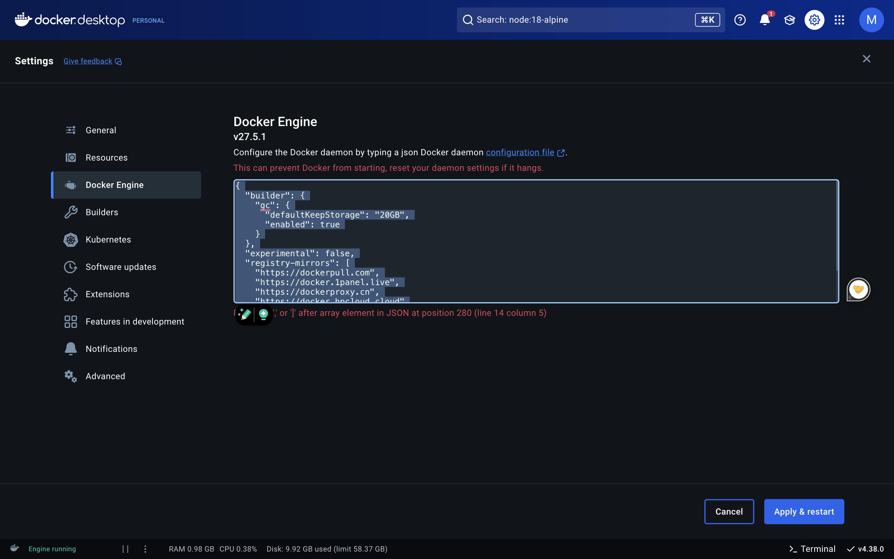

# Docker
>resource: https://docs.docker.com/
## index
- [What is Docker](#what-is-docker)


## What is Docker
>[Click here](https://docs.docker.com/get-started/docker-overview/) to see the detail.

Docker is a platform for developing, shipping, and running applications in containers. Containers package an application with all its dependencies, ensuring it runs consistently across different environments. Key features include:

- ```Containerization```: Isolated application environments
- ```Portability```: Runs consistently across different systems
- ```Efficiency```: Lightweight compared to virtual machines
- ```Isolation```: Separate filesystem, networking, and process space

Main components:
- Docker Engine (core runtime)
- Docker Images (application templates)
- Docker Hub (image repository)

## Before starting
add the following to your Docker daemon:
```
{
  "builder": {
    "gc": {
      "defaultKeepStorage": "20GB",
      "enabled": true
    }
  },
  "experimental": false,
  "registry-mirrors": [
    "https://dockerpull.com",
    "https://docker.1panel.live",
    "https://dockerproxy.cn",
    "https://docker.hpcloud.cloud"
    "https://71f9cedb596c4e7fa40cf931104fc069.mirror.swr.myhuaweicloud.com",
    "https://q9ls9sab.mirror.aliyuncs.com"
  ]
}
```


## Get started
Follow the [official guide](https://docs.docker.com/get-started/) to get started.
>[!NOTE]
When modifying ```greeting``` on the ```todo container```, the path should be 'usr/local/src/app/routes/getGreeting.js'

## Build your own image
Resource: https://docs.docker.com/get-started/introduction/build-and-push-first-image/

1. Install vs code plugin: Docker
2. open getting started todo app folder
3. right click on the Dockerfile and select build image

# Dockerfile Instructions Reference
>[!NOTE]
The ```docker init``` command will analyze your project and quickly create a Dockerfile, a ```compose.yaml```, and a ```.dockerignore```, helping you get up and going. Since you're learning about Dockerfiles specifically here, you won't use it now. But, [learn more about it here](https://docs.docker.com/engine/reference/commandline/init/).

## 1. FROM
- `FROM <image>` - Specifies the base image to start building from. Must be the first instruction (except for ARG).

Format:
- `FROM <image>` - Use latest version of base image
- `FROM <image>:<tag>` - Use specific tagged version
- `FROM <image>@<digest>` - Use specific digest version

Examples:
- `FROM ubuntu:20.04` - Use Ubuntu 20.04 as base
- `FROM node:18-alpine` - Use Alpine-based Node.js 18
- `FROM python:3.9-slim` - Use slim version of Python 3.9

Notes:
1. Can have multiple FROM instructions for multi-stage builds
2. Each FROM clears the state from previous stages
3. Always specify tags for reproducible builds

## 2. WORKDIR
- `WORKDIR <path>` - Sets the working directory for subsequent instructions.

Format:
- `WORKDIR <absolute_path>` - Use absolute path
- `WORKDIR <relative_path>` - Use relative path from previous WORKDIR

Examples:
- `WORKDIR /app`
- `WORKDIR /usr/src/app`
- `WORKDIR /home/node/app`

Notes:
1. Creates directory if it doesn't exist
2. Can be used multiple times in a Dockerfile
3. Can use environment variables defined with ENV

## 3. COPY
- `COPY <src> <dest>` - Copies files/directories from source to destination in image.

Format:
- `COPY <src>... <dest>` - Basic copy
- `COPY ["<src>",... "<dest>"]` - Copy with spaces in paths
- `COPY --from=<stage> <src> <dest>` - Copy from previous stage

Examples:
- `COPY . .` - Copy all files from current directory
- `COPY package*.json ./` - Copy package.json and package-lock.json
- `COPY --from=builder /app/build ./` - Copy from builder stage

Notes:
1. Respects .dockerignore file
2. Preserves file permissions
3. Only copies files, not directories referenced symbolically

## 4. RUN
- `RUN <command>` - Executes commands in a new layer on top of current image.

Format:
- `RUN <command>` - Shell form
- `RUN ["executable", "param1", "param2"]` - Exec form
- `RUN --mount=type=<type> <command>` - With mount options

Examples:
- `RUN npm install`
- `RUN apt-get update && apt-get install -y curl`
- `RUN --mount=type=cache,target=/root/.npm npm ci`

Notes:
1. Each RUN creates a new layer
2. Combine commands with && to reduce layers
3. Use cache mounts for package managers

## 5. CMD
- `CMD <command>` - Provides defaults for executing container.

Format:
- `CMD ["executable","param1","param2"]` - Exec form (preferred)
- `CMD ["param1","param2"]` - Default parameters to ENTRYPOINT
- `CMD command param1 param2` - Shell form

Examples:
- `CMD ["node", "app.js"]`
- `CMD ["npm", "start"]`
- `CMD ["python", "app.py"]`

Notes:
1. Only one CMD instruction effective
2. Can be overridden at runtime
3. Use exec form for direct execution

## 6. EXPOSE
- `EXPOSE <port>` - Informs Docker that container listens on specified ports.

Format:
- `EXPOSE <port>` - TCP port
- `EXPOSE <port>/tcp` - Explicit TCP port
- `EXPOSE <port>/udp` - UDP port

Examples:
- `EXPOSE 3000`
- `EXPOSE 80/tcp`
- `EXPOSE 53/udp`

Notes:
1. Doesn't actually publish ports
2. Documentation purpose only
3. Must still use -p or -P with docker run

## 7. ENV
- `ENV <key>=<value>` - Sets environment variables in the image.

Format:
- `ENV <key> <value>` - Single variable
- `ENV <key>=<value> ...` - Multiple variables

Examples:
- `ENV NODE_ENV production`
- `ENV PORT=3000 DEBUG=true`
- `ENV PATH=/usr/local/bin:$PATH`

Notes:
1. Available during build and runtime
2. Can be overridden at runtime
3. Use ARG for build-time-only variables

## 8. ARG
- `ARG <name>[=<default>]` - Defines build-time variables.

Format:
- `ARG <name>` - Define without default
- `ARG <name>=<default>` - Define with default value

Examples:
- `ARG NODE_VERSION=16`
- `ARG BUILD_DATE`
- `ARG PORT=3000`

Notes:
1. Only available during build
2. Can be overridden with --build-arg
3. Placed before FROM affects base stage

## 9. USER
- `USER <username>` - Sets the user for subsequent instructions.

Format:
- `USER <user>[:<group>]` - By name or UID
- `USER <UID>[:<GID>]` - By numeric ID

Examples:
- `USER node`
- `USER 1000:1000`
- `USER app:app`

Notes:
1. Affects RUN, CMD, and ENTRYPOINT
2. Create user if doesn't exist
3. Important for security
